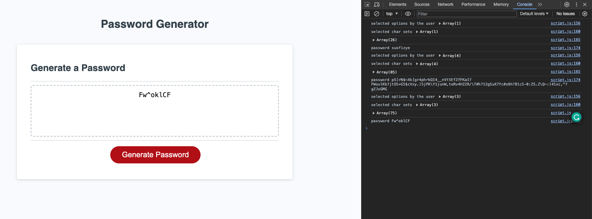

# Password Generator

## Overview

This project is a web application that generates a random password based on user-selected criteria. It runs in the browser and features dynamically updated HTML and CSS powered by JavaScript code.

## Instructions

* Generate a password when the button is clicked
  * Present a series of prompts for password criteria
    * Length of password
      * At least 8 characters but no more than 128.
    * Character types
      * Lowercase
      * Uppercase
      * Numeric
      * Special characters ($@%&*, etc)
  * Code should validate for each input and at least one character type should be selected
  * Once prompts are answered then the password should be generated and displayed in an alert or written to the page

## The Technologies used

- **HTML5**
- **CSS3**
- **JavaScript**
- **Git and GitHub**

## Approach

This password generator application follows a structured approach to ensure the generated passwords meet user-specified criteria. Here's an overview of the key components:

**Storing Password Options:**

   - All possible password options, including special characters, numbers, lowercase, and uppercase letters, are stored in an object called `passwordArrays`. This object serves as a reference for the available character sets.

**User Input Handling:**

The application prompts the user to specify the desired password length, ensuring it falls within the range of 8 to 128 characters.
Users are then asked if they want their password to include lowercase characters, uppercase characters, numbers, and special characters. At least one of these options must be selected.

**Random Element Selection:**

The application extends the Array prototype to include a getRandom method, facilitating the selection of a random element from an array.

**Password Generation:**

The generatePassword function combines the user-selected options and password length to create a random password.
It filters the selected options, maps them to the corresponding character sets from passwordArrays, and flattens the results into a single array.
A loop then iterates over the desired password length, randomly selecting characters from the merged array to construct the final password.

## Usage

The application presents a series of prompts for password criteria, including the length of the password and the types of characters to include (lowercase, uppercase, numeric, special characters). 

The code validates each input, ensuring that the password meets the specified criteria. At least one character type must be selected.

1. Clone the repository.
2. Open `index.html` in your preferred web browser.

Link to  <a href="https://github.com/D-Tsonev/Password-Generator">Repository</a>

Link to  <a href="https://d-tsonev.github.io/Password-Generator/">GitHub Page</a>

